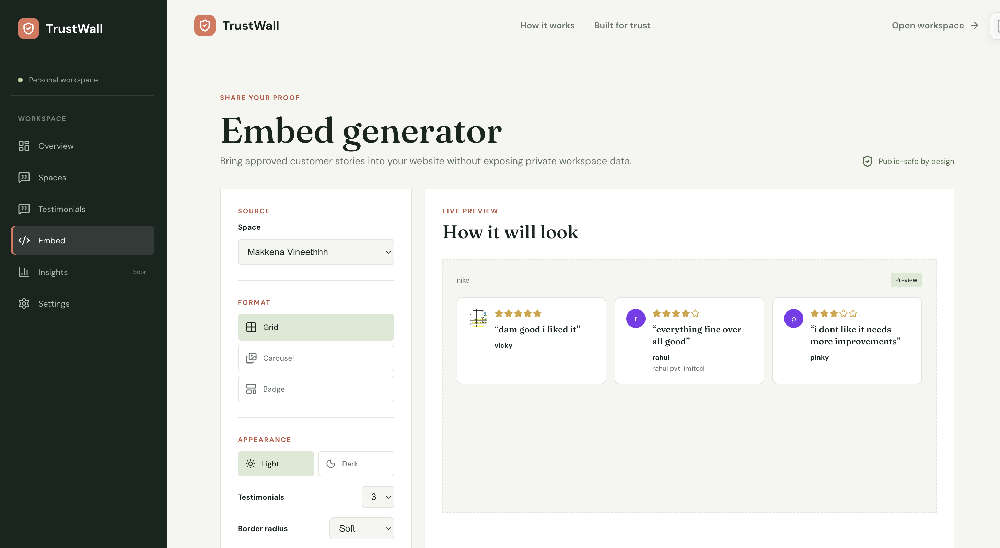

# TrustWall

TrustWall is a testimonial and social-proof collection platform that helps businesses collect, manage, organize, and share customer testimonials through public testimonial walls and embeddable widgets.

## Problem Statement

Businesses often collect customer feedback through different channels, making it difficult to organize, manage, and display testimonials in one place.

TrustWall provides a centralized platform where users can:

* Create testimonial collection spaces
* Share collection links with customers
* Manage submitted testimonials
* View testimonial insights
* Create public testimonial walls
* Generate embed code for websites

## Features

### Authentication

* User registration and login
* Protected dashboard routes
* Authentication-based access to user data

### Dashboard

* Overview of testimonial activity
* Manage testimonial spaces
* View collected testimonials
* View insights and analytics

### Testimonial Collection

* Create testimonial collection spaces
* Generate shareable collection links
* Allow customers to submit testimonials
* Store testimonial data in MongoDB

### Testimonial Management

* View collected testimonials
* Manage testimonials by space
* Organize customer feedback
* Copy collection links easily

### Public Testimonial Wall

* Display testimonials on a public page
* Share public testimonial wall links
* Present customer feedback in a dedicated layout

### Embed Generator

* Generate embed code for testimonial walls
* Use testimonials on external websites

### Settings

* Manage account and application settings
* Configure available user preferences

## Tech Stack

### Frontend

* React
* Vite
* JavaScript
* HTML
* CSS
* Axios
* Lucide React

### Backend

* Node.js
* Express.js
* MongoDB
* Mongoose
* JWT-based authentication

### Other Libraries and Services

* **Axios:** Used for making HTTP requests from the frontend to the backend.
* **Express.js:** Used to build REST APIs and backend business logic.
* **MongoDB:** Used to store users, spaces, and testimonials.
* **Mongoose:** Used for MongoDB schema design and database interaction.
* **JWT:** Used for authentication and protected routes.
* **Vite:** Used for frontend development and build tooling.
* **Lucide React:** Used for interface icons.

## Screenshots


### Sign Up Page


### Sign In Page


### Overview Page


### Overview Page - Additional View


### Spaces Page


### Space Creation Page


### Testimonials Page


### Insights Page


### Settings Page


### Settings Page - Additional View


### Embed Generator



### Public Wall


### Public Wall - Additional View


### Copy Collection Link Page


### Copy Collection Link Page - Additional View


## Project Structure

```text
trustwall/
├── client/
│   ├── public/
│   ├── src/
│   │   ├── components/
│   │   ├── pages/
│   │   ├── services/
│   │   ├── context/
│   │   └── App.jsx
│   ├── package.json
│   └── vite.config.js
│
├── server/
│   ├── config/
│   ├── controllers/
│   ├── middleware/
│   ├── models/
│   ├── routes/
│   ├── utils/
│   ├── server.js
│   ├── package.json
│   └── .env.example
│
├── docs/
│   └── screenshots/
│
├── .gitignore
└── README.md
```


## Prerequisites

Install the following before running the project:

* Node.js
* npm
* MongoDB
* Git

## Installation

Clone the repository:

```bash
git clone https://github.com/vineethmakkena/trustwall.git
cd trustwall
```

## Backend Setup

Navigate to the server directory:

```bash
cd server
npm install
```

Create the environment file:

```bash
cp .env.example .env
```

Open the `.env` file and configure the required variables.

Example:

```env
PORT=5001
MONGO_URI=mongodb://127.0.0.1:27017/trustwall
JWT_SECRET=your_secure_jwt_secret
CLIENT_URL=http://localhost:5173
```


## Database Setup

TrustWall uses MongoDB.

Make sure MongoDB is running locally or provide a MongoDB connection string through the `MONGO_URI` environment variable.

The default local database name is:

```text
trustwall
```

The application creates and uses the required collections through the backend models.

## Run the Backend

From the `server` directory:

```bash
npm run dev
```

The backend runs on:

```text
http://localhost:5001
```

### Backend Health Check

Open the following URL in your browser or API client:

```text
http://localhost:5001/api/health
```

Expected response:

```json
{
  "success": true,
  "message": "TrustWall API is running"
}
```

## Frontend Setup

Open a new terminal window and navigate to the client directory:

```bash
cd client
npm install
```

If the frontend requires an environment file, create it using the project’s environment example file and configure the backend API URL.

Example:

```env
VITE_API_URL=http://localhost:5001/api
```

## Run the Frontend

From the `client` directory:

```bash
npm run dev
```

The frontend runs on:

```text
http://localhost:5173
```

## Running the Complete Application

Run the backend and frontend in separate terminals.

### Terminal 1 - Backend

```bash
cd server
npm install
npm run dev
```

### Terminal 2 - Frontend

```bash
cd client
npm install
npm run dev
```

Then open:

```text
http://localhost:5173
```

## API Overview

The backend provides REST APIs for authentication, users, testimonial spaces, testimonials, public walls, and application health checks.

### Health Check

```http
GET /api/health
```

### Authentication

```http
POST /api/auth/register
POST /api/auth/login
```

### User Operations

The application provides authenticated user-related operations according to the implemented backend routes.

### Space Operations

The application provides APIs for:

* Creating testimonial spaces
* Fetching spaces
* Updating spaces
* Managing space information

### Testimonial Operations

The application provides APIs for:

* Submitting testimonials
* Fetching testimonials
* Managing testimonials
* Displaying testimonials on public walls

> Refer to the route files inside `server/routes/` for the complete and current endpoint list.

## Authentication

TrustWall uses token-based authentication.

* Users can register and log in.
* Protected routes require authentication.
* JWT tokens are used to identify authenticated users.
* User-specific data is accessed through authenticated requests.

## Database Models

The application uses MongoDB with Mongoose.

The main data entities include:

### User

Stores user account information such as:

* Name
* Email
* Password information
* Account-related details

### Space

Represents a testimonial collection space.

A space may contain:

* Space name
* Description
* Owner information
* Collection settings
* Related testimonials

### Testimonial

Stores customer feedback collected through a testimonial space.

A testimonial may contain:

* Customer name
* Customer email or related information
* Testimonial content
* Related space
* Creation date
* Status or management information

> The exact fields are defined in the Mongoose models inside `server/models/`.

## Validation and Error Handling

The application includes validation and error handling for common operations such as:

* Required fields
* Invalid user input
* Authentication failures
* Unauthorized requests
* Invalid resource IDs
* Database operation errors
* API request failures

Error responses are handled by the backend and displayed by the frontend where applicable.

## Security Considerations

TrustWall includes basic security practices suitable for a technical assessment project, including:

* JWT-based authentication
* Protected backend routes
* Environment variables for configuration
* Password protection through authentication logic
* User-specific data access
* Backend validation and error handling

This project is an assessment MVP and is not presented as a fully production-ready enterprise application.

## Assumptions and Limitations

* MongoDB must be available for the application to work correctly.
* The application is intended to run locally during evaluation.
* Environment variables must be configured before starting the backend.
* The frontend and backend run on separate development ports.
* Some advanced production features such as deployment automation, advanced monitoring, and enterprise-level security hardening are outside the current scope.
* The exact API endpoints may change as development continues.

## Future Improvements

Possible future improvements include:

* Email notifications for new testimonials
* Advanced testimonial moderation
* More detailed analytics
* Role-based access control
* Cloud deployment
* Automated testing
* Improved embed customization
* Image and video testimonial support
* Social media sharing
* Custom branding options
* Better accessibility support
* Performance optimization

## Demo Video

Project explanation video:

```text
[Add your public demo video link here]
```

The video should cover:

* Project introduction
* Problem statement
* Main features
* Technology stack and reasons for choosing it
* Application architecture
* Database structure
* Backend APIs and business logic
* Frontend implementation
* Technical decisions
* Challenges faced
* Additional features
* Incomplete features and possible improvements

## Repository

GitHub Repository:

https://github.com/vineethmakkena/trustwall

## Author

**Vineeth Makkena**

B.Tech - Artificial Intelligence
Parul University of Engineering and Technology

## License

This project is created for technical assessment and educational purposes.
